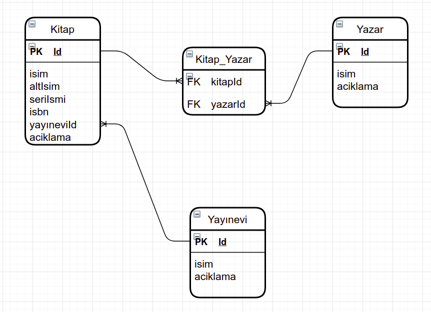

# Kütüphane Uygulaması
### (Personal Library)
[Demo](http://ec2-18-184-188-27.eu-central-1.compute.amazonaws.com:8080/) için tıklayınız.
### 1. Uygulamanın İşlevleri
- Bu uygulamayı şahsi kütüphanenizdeki kitapları kayıt etmek için kullanabilirsiniz.
- Kitap kayıt, yazar kayıt, yayınevi kayıt etme ve bu kayıtları inceleme, güncelleme ve silme fonksiyonları bulunmaktadır.
- Ayrıca arama sayfasından kitap adı, kitap seri adı, ISBN ve yazr adı bilgileri ile arama yapılabilir.

### 2. Kurulum ve Çalıştırma Adımları
- Kütüphane uygulaması bir web uygulamasıdır. Tarayıcı üzerinde çalışmaktadır.
- Yerel (`localhost`) olarak bilgisayarınızda çalıştırabilir, ya da sunucu üzerinde kurularak uygulama arayüzüne bilgisayar, tablet, mobil cihazlardan erişilebilir.
- Kurulum için bilgisayarda [**Java Development Kit (JDK) 11**](https://adoptopenjdk.net/) veya üstü bir sürümü bulunmalıdır.
- Ayrıca kod reposunu kolaylıkla bilgisayara kopyalamak için `git` uygulaması tavsiye edilir. Ancak kod dosyaları `GitHub` üzerinden sağ üstteki yeşil renkli `Code` düğmesine tıklanarak `zip` dosyası olarak da indirilebilir.
- Repoyu kopyalamak için komut satırından aşağıdaki komutu yazın.
  - `git clone https://github.com/milikkan/personal-library.git`
- Ardından şu komutla proje kök dizinine geçin.
  - `cd personal-library`
- **1.yöntem:** Spring Boot plugin. Aşağıdaki komutu çalıştırarak projeyi derleyin ve çalıştırın
  - `./mvnw spring-boot:run`
  - Gerekli bağımlılıklar indirilip derlenerek program çalışmaya başlayacaktır. İnternet bağlantı hızına göre 1-2 dakika sürebilir.
  - Tarayıcıdan `http://localhost` adresine giderek uygulamayı deneyebilirsiniz.
- **2.yöntem:** Maven ile projeyi `jar` olarak paketleyip, çalıştırabilirsiniz.
  - Bilgisayarınızda *Maven* kurulu olmasa bile repo içerisinde gelen `mvnw` dosyası bir Maven kabuğu (*wrapper*) içermektedir. `mwnw.cmd` Windows versiyonudur.
  - Önce aşağıdaki komutla projeyi derleyin. Bu komut sonucunda `/target` dizini altında bir `jar` dosyası oluşturulacaktır.
    - `./mvnw clean package`
  - Jar dosyasını çalıştırın: `java -jar target/ personal-library-0.0.1-SNAPSHOT.jar`
    
### 3. Kullanılan Teknolojiler
#### a. Veri Tabanı
- Veritabanı olarak spesifik bir veritabanı yönetim sistemi kullanılmamıştır. `JPA` teknolojisi kullanılmıştır. Spring Data JPA projesi `JPA` implementasyonu olarak `Hibernate` kullanmaktadır.
- Bu kapsamda JPA desteği olan tüm ilişkisel veritabanı yönetim sistemleri uygulamanın veritabanı olarak kullanılabilir. NoSQL veritabanı kullanılamaz.
- Uygulamanın deneme sürümü `H2` isimli `in-memory` bir veritabanı kullanmaktadır. Proje kök dizinindeki `application.properties` dosyasında veritabanı ayarları bulunmaktadır. 
- Başka veritabanları kullanmak için öncelikle ilgili bağımlılılar `pom.xml` dosyasına eklenmeli ve daha sonra `application.properties` dosyasında veritabanı ismi, kullanıcı adı ve şifre bilgileri doldurulmalıdır.
- MySQL ile denemesi yapılmış, çalıştığı görülmüştür.
#### b. Arkayüz (Backend)
- Spring Boot 2.4.2 sürümü. Bağımlıklıklar (detayları pom.xml dosyasında görülebilir):
  - Spring Data JPA (Hibernate)
  - Thymeleaf şablon aracı (*template engine*)
  - Spring Boot Starter Web (MVC desteği için)
  - H2 veri tabanı
  - Spring Boot Starter Validation (JakartaEE Bean Validation)
  - Lombok
  - JUnit5 (*TDD uygulanmadı, Birim testler yazılmadı.*)
- Maven proje yönetim ve *build* aracı
#### c. Önyüz (Frontend)
- Önyüz için HTML dosyaları (`view` katmanı), arkayüzde `Thymeleaf` tarafından üretilmektedir. Dolayısıyla önyüze JSON veya XML gibi formatlar yerine doğrudan HTML gelmektedir.
- Spring MVC mimari paterni kullanılmıştır. 
- Önyüzde `Bootstrap 5` kullanılmış, hariçten  CSS yazılmamıştır.
- Dinamik DOM manipülasyonu için sade JavaScript kullanmılmış, önyüz kütüphaneleri kullanılmamıştır.
### 4. Teknik Seçimler ve Nedenleri
- Veri tabanı ER diyagramı aşağıda gösterilmektedir.
  
  
  - Kitap-Yazar ilişkisi -> many-to-many, çünkü bir kitabın birden çok yazarı, bir yazarın birden çok kitabı olabilir. JPA tarafından ara tablo (*kitap_yazar*) otomatik olarak oluşturulmaktadır.
  - Kitap-Yayınevi ilişkisi -> many-to-one, çünkü bir kitap bir yayınevi tarafından basılabilir ancak bir yayınevi birden çok kitap basabilir. Bu kapsamda kitap tablosunda sadece *yayınevi_id* sütunu `foreign key` olarak yer almaktadır.
  - Bu ilişkilerden dolayı, yayınevi ancak üzerinde kitap olmadığında silinebilmektedir. Yazar da aynı şekilde, yazdığı bir kitap yoksa silinebilmektedir. Uygulamada silme butonları bu şart sağlanmadığı sürece pasif yapılmıştır. Eğer URL ile silme yapılmaya çalışılırsa, kullanıcı hata sayfasına yönlendirilmektedir.
- Uygulama çapında hata (`exception`) yakalamak için `ControllerAdvice` kullanıldı. Halihazırda kitap, yazar ve yayınevi bulunanamasına yönelik özel hatalar tanımlandı. Ayrıca tüm hataları karşılayan genel bir hata sayfası da yapıldı.
- Validasyon arkayüzde `javax.annotation` anotasyonları ile yapılmaktadır. Önyüzde sadece Bootstrap ile stil verilmektedir.
- Kitap ekleme ve güncelleme sayfalarında, Yazarlar mevcut yazarlar içerisinden seçilebilmekte, yeni yazarlar tanımlanabilmekte, ya da her ikisinin karışımı bir yaklaşım uygulanabilmektedir. Kitap kaydedilmeden önce girilen yazar listesi Controller ve Servis katmanlarında kontrolden geçirilmekte, veritabanında var olan yazarlar eşlenmekte ve her seferinde yeni kayıt yaratılmasının önüne geçilmektedir.
- Yeni yazar ve yayınevi yaratılması sadece kitap girişi esneasında yapılabilmektedir. Daha sonra girilen yazar ve yayınevi kayıtları güncellenebilmektedir. 
- Yazar ve yayınevi yaratma işlemi kitap yaratmaya bağımlı olduğundan, bunların validasyonu kitap ekleme sayfasında yapılmaktadır. Yazar ve yayınevi ismi girilmesi zorunlu olduğundan, bu kısıtı sağlamak üzere simüle hatalar forma bind edilmektedir. Yazar ve yayınevi entity'lerindeki validasyonlar güncelleme sayfalarında yapılmaktadır.
- Arama için 4 kutudan boş bırakılan olursa, bu kriter yok sayılmaktadır. Sadece doldurulan kriterlerin ortak olduğu kayıtlar getirilmektedir. 
  - Arama mantığı girilen kelimenin, ilgili alan içerisinde bulunup bulunmamasına bakmaktadır. (containing). 
  - Şu anda arama büyük ve küçük harfe duyarlıdır. Bu daha sonra değiştirilecek, Türkçe ve İngilizce büyük küçük harf değişimleri nedeniyle Locale tanımlanacaktır.
  - Arama JpaRepository üzerinde tanımlanan *custom* bir metotla yapılmaktadır. Spring Data JPA metot imzasına bakarak arka planda gerekli SQL sorgusunu üretmektedir. Uygulamada hiç SQL sorgusu kullanılmamıştır. Bu yaklaşım kod okunurluğunu düşürmektedir ancak alışınca pratik ve hızlı geliştirmeye olanak sağlamaktadır.
- Fazla kod tekrarını önlemek için `Lombok` kütüphanesi kullanılmıştır.
- Aynı şekilde fazla HTML yazmayı önlemek ve uygulama görünümünü sayfalar arasında standart hale getirmek için Thymeleaf şablonları kullanılmış, her sayfanın ilgili bölümleri ana şablon üzerinde değiştirilerek üretilmiştir.
### 5. Devam Eden İşler ve Eksik Hususlar
- Kullanıcıların şifre ile giriş yapması
- Kullanıcı yetki seviyelerinin eklenmesi
- Listeleme sayfalarına *pagination* özelliği eklenmesi
- Arama kriterlerinin büyük veya küçük harf duyarsız olması
- Aynı yazar bir kitaba birden fazla kere eklenebiliyor, düzeltilecek
- Diğer hususlar *Issues* sekmesi altında yazılmıştır.